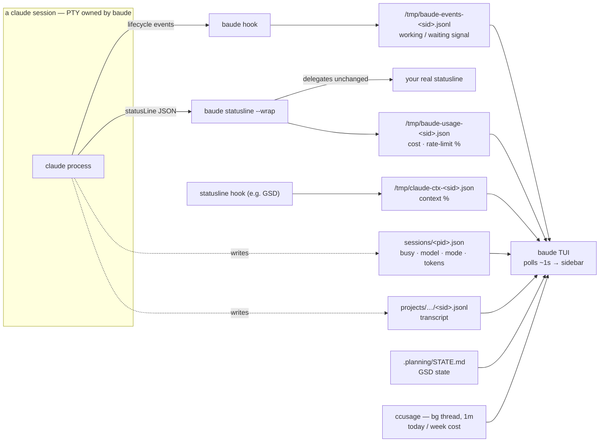

# baude

A TUI for running multiple AI coding sessions in one terminal — Claude Code
by default, [opencode](https://opencode.ai) as an alternative backend, each
in its own hard-separated [workspace](#workspaces).

Start it from any existing folder. A Git folder admits one durable repository parent with
its main checkout and managed worktrees as children. Repository parents sort
by name; each parent's children retain their persisted oldest-first order
across restarts. Runtime status, attention, and archive changes decorate those
rows without moving them. Checkout/worktree rows are the primary visual and
navigation level; their repository context remains visible as a muted indented
label. Selection follows durable `RepositoryKey` and `CheckoutKey` identities
while baude is running. After restart it initializes at the first available
checkout, using a repository parent only when that repository has no available
checkout, rather than persisting the prior selection. A shell pane at the
selected checkout is one keystroke away. On macOS, a [desktop banner](#configuration)
also names the session that blocked.

A non-Git folder is admitted as a durable standalone session at the top level.
It supports the same coding-agent, shell, editor, resume, archive, close, info,
activity, and GSD flows without inventing repository identity. Branch creation
and managed-worktree removal stay unavailable. Canonical paths deduplicate
aliases, and schema-v3 state retains standalone sessions across restarts.

Each session surfaces live metadata — model, token counts, cost, GSD project
state, and (Claude Code) context usage and permission mode.

```
╭ baude ──────────────────╮╭ api · waiting · bypass ───────────────╮
│▸ ● api              4m  ││ > claude is waiting for your answer...│
│  fable-5 63% bypass     ││                                       │
│  ● webapp           1m  │╰───────────────────────────────────────╯
│  fable-5 12% ask ph4.5  │╭ shell @ ~/code/api ───────────────────╮
│  ◐ infra                ││ ❯ git diff                            │
│  fable-5 81% bypass     ││                                       │
╰─────────────────────────╯╰───────────────────────────────────────╯
```

## Install

Install the latest stable release via [mise](https://mise.jdx.dev) — the
release tarball includes both `baude` and `bauded`:

```sh
mise use -g github:poindexter12/baude
```

Verify with `mise exec -- baude --version`. For an isolated source build and
test environment, follow the
[local TUI dogfood runbook](docs/local-tui-dogfood.md).

### Contributor commit-message guard

release-please cannot parse nested parentheses in a commit header or body and
silently omits that commit from a release. Enable this repository's local guard
once after cloning:

```sh
git config core.hooksPath .githooks
```

The CI `check` job also validates every PR commit and its title, so squash
merges cannot introduce the same parser trap.

## Usage

```sh
cd ~/code/some-repo
baude            # or: baude /path/to/repo
```

Repository parents, checkout children, their durable keys and oldest-first
order, retained conversation context, and shell-pane state persist across
restarts per workspace (`~/.config/baude/state-<workspace>.json`). Selection
is not persisted: relaunch starts at the first available local checkout, falls
back to its repository parent when no checkout is available, then uses the first
flat remote row when no local target exists. Eligible active children resume
through the backend's resume form (`claude --continue` /
`opencode --continue`); retained closed children wait for an explicit reopen.

## How it works

This section describes the default **Claude Code** backend; the
[opencode backend](#opencode-backend) inverts the model — opencode runs an
HTTP server per session and baude polls that instead of reading files.

baude never asks Claude Code for anything — it **reads what Claude writes to
disk**. Every session is a real `claude` process in a PTY that baude owns.
baude auto-seeds four lifecycle hooks into each session's `.claude/settings.local.json`;
the `statusLine` bridge is configured once (in your Claude settings, or seeded
by the container). baude then polls the resulting artifacts about once a second
to render the sidebar.



The [Session metadata](#session-metadata) and [Usage panel](#usage-panel)
sections below detail each source. When Claude's own session file or hook
events are present they drive the precise working/waiting signal; absent those,
baude falls back to a PTY output-silence heuristic.

## Keys

A few global chords work the same everywhere; everything else passes straight
through to Claude.

| Key | Where | Action |
|-----|-------|--------|
| `ctrl+q` | anywhere | step out to the sidebar |
| `ctrl+\` | anywhere | toggle shell pane (opening focuses it) |
| `ctrl+e` | anywhere | open the session folder in your editor |
| `ctrl+n` | anywhere | new session (steps out to the sidebar) |
| `alt+←/→` | anywhere | cycle to the prev/next actionable checkout/session child (wraps; skips archived and closed rows) |
| `ctrl+o` | anywhere | link hints (inspect/copy/open urls) |
| `alt+↑/↓` | claude or shell pane | move focus to the pane above/below (shell sits below claude) |
| `shift+enter` | claude pane | insert a newline without submitting |
| `enter` | sidebar | open a parent's default child, attach a live child, or reopen an eligible retained child |
| `j/k` `↑/↓` | sidebar | select repository parents, checkout children, or flat remote rows |
| `t` | sidebar | open shell pane (focuses it) |
| `e` | sidebar | open the session folder in your editor (`editor_cmd`, default `code`) |
| `i` | sidebar | repository or checkout/session details |
| `g` | sidebar | GSD project state (`.planning/STATE.md`) |
| `n` | sidebar | new session (enter a repo path; `tab` completes, `ctrl+u` clears; not-yet-cloned repos fall through to `c`) |
| `c` | sidebar | clone a repo (GitHub URL or `owner/repo`) and start a session in it |
| `w` | local repository/child | create a valid branch or activate an eligible existing local branch as a managed worktree |
| `r` | eligible child | retry only the reopen/recovery action authorized for that durable checkout |
| `a` | applicable child | archive/unarchive (archived rows hide until revealed with `z`) |
| `z` | sidebar | show/hide archived sessions (hidden by default; the footer shows the count) |
| `f` | sidebar | show all sessions / scope back to the launch folder's context (see "Folder context") |
| `x` | running child | close the runtime and retain its checkout for reopening |
| `X` | managed worktree child | after a fresh clean-state check and distinct confirmation, remove the worktree while retaining its branch |
| `?` | sidebar | help |
| `q` | sidebar | quit |

To close from a pane, press `ctrl+q` to return to the sidebar, then `x`.
`ctrl+x` passes through unchanged for opencode, nano, and other terminal apps.

`alt+←/→` and `alt+↑/↓` need your terminal to send Option/Alt as a modifier — on macOS
Terminal and iTerm2 enable this with "Use Option as Meta key". While attached,
these chords shadow Claude's own alt+←/→ word navigation. Likewise `ctrl+e`,
and `ctrl+n` are intercepted everywhere, so they never reach the shell pane's
readline (end-of-line, next-history) or the AI CLI.

### Shift+Enter newlines

Inserting a newline with `shift+enter` is negotiated at startup through the
kitty keyboard protocol: baude asks the terminal whether it can report the
Shift modifier on Enter and only changes behavior when it answers yes. See
[Tested terminals](#tested-terminals) below for where that negotiation is
exercised.

On terminals without the protocol, nothing changes: the terminal reports
Shift+Enter as plain Enter, so it submits — exactly the pre-existing
behavior. baude never guesses a missing modifier.

Without protocol support you can still compose multiline prompts with the
child program's own bindings: Claude Code accepts backslash-then-Enter (or
run its `/terminal-setup` command); opencode uses `ctrl+j`.

Inside tmux or screen, the negotiation talks to the multiplexer, not your
outer terminal — tmux passes Shift+Enter through only with its
`extended-keys` option enabled (e.g. `set -s extended-keys on` in
`.tmux.conf`).

### Link hints

`ctrl+o` opens a hint overlay listing the links currently visible in the
focused pane — OSC 8 hyperlinks and bare `http(s)://` urls alike. Each row is
lettered and shows the link's **actual destination**, never its display label.
That is the whole point of the preview: a link rendered as `docs` shows you the
url it would really send you to before you open it. Long destinations are
middle-truncated to fit the pane width only, so the scheme and host stay
visible, and the full url is what gets copied or opened.

The overlay footer names every gesture it accepts:

```
enter opens · c/y copies · j/k moves · esc closes — 7 links
```

At most ten rows are listed at a time; `j/k` moves through the rest.

Only validated HTTP(S) destinations are collected, so every row in the overlay
is activatable. Unsupported schemes, malformed targets, and anything carrying
control characters stay ordinary, non-activatable text. Session output alone
never opens a link — activation is always this explicit gesture. If the system
opener fails, baude reports it honestly (`open failed: … — session unaffected`)
and the session keeps running.

Because baude intercepts `ctrl+o`, the chord no longer reaches the child
program.

### Mouse, selection, and scrollback

baude turns mouse capture on at startup, unconditionally, and consumes the
events itself — so your terminal's own drag-to-select is suppressed for as long
as baude is running. Click and drag inside a pane is baude's own selection
instead: releasing copies the selected region to the system clipboard
(`pbcopy` on macOS, `wl-copy` or `xclip` on Linux), and a copy that fails says
so rather than looking like success. When you want the terminal's native
selection anyway — to grab text spanning both panes, or to use the terminal's
own selection buffer — hold your terminal's override modifier while you drag.
Which key that is belongs to the terminal, not to baude: Shift is the common
one, and some macOS terminals use Option.

The wheel scrolls whichever pane the pointer is over. When the child program in
that pane has its own mouse mode on — a full-screen editor or pager — baude
forwards the scroll to it instead, so those programs keep scrolling themselves.

baude also runs on the alternate screen: it enters at startup and leaves on
exit. Session output therefore never enters your host terminal's scrollback,
and scrolling back through a session is baude's own handling inside the pane
rather than your terminal's. On exit baude puts back everything it changed —
mouse reporting off, bracketed paste off, alternate screen left — and whatever
your terminal was showing before baude started is still there.

### Tested terminals

The negotiated gestures — `shift+enter` newlines, `ctrl+o` link hints, and
mouse capture with its selection and scrolling — are exercised together in
Ghostty, kitty, iTerm2, WezTerm, foot, and Alacritty. "Verified" means exactly
that: the gestures were driven by hand in those terminals, not that
compatibility is guaranteed anywhere else. Each release records the exact
terminal identities and OS versions the gestures were observed in, in that
release's smoke evidence.

## Status codes

Status is shown as a static single-character code in the sidebar, never
animated. Each row displays its code in a fixed color:

- `?` waiting for your input (yellow, bold) — with a wait timer
- `B` busy — claude is working (blue)
- `✓` completed — turn finished, your move (green)
- `✗` exited (dark gray; `r` to restart)
- `-` closed checkout, no live session (gray)
- `A` archived (dark gray)
- `!` unavailable or missing (yellow)

The codes are static: nothing in the sidebar animates, so an idle baude
issues zero terminal writes. A one-line legend
(`? waiting  B busy  ✓ done  ✗ exited  - closed  A archived  ! unavailable`)
sits above the usage footer when the terminal is at least 21 rows tall, and
`?` (help) lists the codes.

Waiting is detected from PTY output silence: the CLI streams output
continuously while working, so ~2s of quiet means it's your turn. Better
sources take precedence when present
(`exited > hook event > session file > output silence`): Claude Code's own
session file and lifecycle hooks, or — for opencode — the session server's
live status endpoint (reported at the session-file tier).



```mermaid
stateDiagram-v2
    [*] --> working
    working --> waiting: Stop hook / ~2s output silence
    waiting --> working: you reply, or a new turn starts
    working --> exited: claude exits
    exited --> working: r — restart (claude --continue)
    waiting --> archived: idle timeout (auto, default 30m), or a (manual)
    archived --> waiting: input re-engages auto-archive; a unarchives a manual one
```

Sessions waiting unattended past the idle timeout auto-archive (default 30
minutes; `auto_archive_minutes` in config or `BAUDED_AUTO_ARCHIVE_MIN`, 0
disables). Archived sessions hide from the sidebar: a dim footer counts them
and `z` reveals them in their persisted positions (they never reorder). A
repository whose children are all archived collapses to its parent row with an
`N archived` chip. `alt+←/→` cycling always skips archived and closed rows;
`j/k` reaches revealed rows. Sending an auto-archived session input re-engages
it; a manual archive (`a`) sticks until you unarchive or re-engage. The daemon
applies the same archive rules to its separate flat rows, and archived
sessions never send push notifications.

## Folder context

### Session breadcrumbs

baude leaves breadcrumbs per launch folder: the sessions a run actually used
(opened, typed into, created with `w`, or admitted) are recorded against the
folder baude was started in, and the next launch from that folder scopes the
sidebar to exactly those rows. Everything else in the workspace stays put —
`f` reveals the full list (a dim footer counts what's hidden), and
interacting with a revealed row adds it to the folder's context permanently.
The first launch in a folder starts with just that folder's own repository or
standalone session, and the launch also restores the selection to the session
you last used from there.

Breadcrumbs live in `~/.config/baude/breadcrumbs-<workspace>.json` — nothing
is ever written into your repositories. Entries reference sessions by path,
prune automatically when a checkout or folder leaves durable state, and a
corrupt file just means a fresh context. Remote (`⇄ remote`) rows are not
scoped in this release: launch-folder attribution isn't reliable for daemon
sessions, so they always render.

### Workspace memory (ancestor walk)

Folder memory also covers the [workspace](#workspaces): every launch records
which workspace the folder ran in (`~/.config/baude/folder-workspaces.json`).

**Walk behavior:** When you launch baude, it walks up from your launch directory checking each ancestor folder for a recorded binding. The first binding found is used; if no binding exists at any level, the walk returns None and precedence continues to the next tier.

**Boundary:** The walk stops at your home directory (`$HOME`) and does not continue above it. If your launch directory is outside your home (e.g., in `/tmp`), the walk stops at the filesystem root.

**Recording:** When you launch from a new repository without a binding, baude derives the workspace name from the repository root's folder name and records the binding for that repository root, so future launches from any subfolder of that repository use the same workspace.

**Override or rebind:** To use a different workspace for a folder path, use one of these approaches in order of priority:
1. Set `BAUDE_WORKSPACE` environment variable (highest priority)
2. Delete the binding from `~/.config/baude/folder-workspaces.json` and re-launch to record a new derived binding
3. Set the config `workspace` key — but note that ancestor bindings have priority, so if a parent folder has a recorded binding, the config value does not override it
4. To override an ancestor binding, use `BAUDE_WORKSPACE` env var

**Kill switch:** Set config `folder_context: false` to disable folder memory entirely; the walk is skipped and precedence goes directly to config workspace key (if any), BAUDE_BACKEND, config backend, then default. This also disables session breadcrumbs.

## Cloning

`c` starts a session in a repo you haven't cloned yet. Paste anything that
names a GitHub repo — an ssh or https clone URL, a browser URL (trailing
`/tree/...` is fine), or just `owner/repo` — then confirm the destination,
which defaults to `<clone_base_dir>/<host>/<owner>/<repo>` (tab completes).
The clone runs in the background so the TUI stays responsive, and the
session opens when it finishes. Shorthand and ssh inputs clone over ssh
(`git@host:owner/repo.git`); pasted `https://` URLs keep https. If the
destination already holds a clone, baude just opens a session there.

The `n` prompt falls through to the same flow: if what you enter isn't a
directory on disk but names a repo — a URL, `owner/repo`, or a path whose
tail looks like `<host>/<owner>/<repo>` (e.g. a not-yet-cloned
`~/Code/github.com/owner/repo`) — baude offers to clone it, prefilling the
destination with the path you typed. No need to back out and re-enter via
`c`.

## Worktrees

Each admitted repository remains visible as a parent even when none of its
children has a running backend. Its main checkout, any separate managed
default checkout, and retained linked worktrees remain visible as durable
children in persisted oldest-first order.

Managed worktree directories are identified by a stable digest of the
repository's canonical git common directory (output of `git rev-parse
--git-common-dir`). The digest is the first 12 characters of the SHA256 hash,
formatted as `repository-<12 hex digits>/<role>-<checkout_key>`. This ensures
two processes admitting the same repository derive the same path without
coordination. Existing legacy counter-based directories (`repository-1`,
`repository-2`, etc.) from earlier baude versions are recognized in place; the
digest scheme applies only to new repositories.

A small `.baude-marker.json` file inside each managed directory records and
verifies ownership. On first admission of a legacy directory, baude writes a
marker; after a state file reset, markers enable recovery without a scan. If
two repositories converge on the same path (rare, but possible under legacy
counters), baude detects the collision via the marker file and allocates the
newcomer a distinct digest-keyed directory (`repository-<12hex>-2`, etc.). The
collision is reported non-destructively in `baude worktrees scan --json` output
with the owning repository named.

From a local parent or child, `w` creates a valid local branch or activates an
eligible existing local branch in a managed path beneath
`~/.local/share/baude/worktrees/`, then starts the active workspace backend.
baude does not fetch, guess a branch, or switch the main checkout. Lowercase
`x` closes only the runtime and keeps the checkout row for later reopening.
Uppercase `X` is a separate action: it is available only for a baude-managed
linked worktree, performs fresh topology and clean-state checks around an
exact-target confirmation, and uses ordinary non-destructive Git removal.
Dirty, conflicted, locked, submodule-unsafe, or indeterminate state blocks the
operation. A successful `X` removes only that worktree and child; its local
branch, repository parent, and siblings remain. After a state file reset, the
same repository is found again by computing its digest from the canonical git
common directory; no scan is required for recovery.

## Usage panel

The bottom of the sidebar shows what you're consuming, and the status bar
shows when the limits refill:

```
│ ──────────────────────│
│ sess            $1.23 │   selected session cost (live)
│ today          $63.58 │   all Claude usage today      (ccusage)
│ week          $104.05 │   all Claude usage this week  (ccusage)
│ 5h ▓▓▓▓▓░░░░░ 47%     │   5-hour block — real account rate limit
│ wk ▓▓▓░░░░░░░ 32%     │   weekly window — real account rate limit
╰───────────────────────╯
 hints │ ~/code/api ⎇ main      ● 2 waiting · 5h resets in 46m · wk in 10d
```

- **today/week cost** — from [`ccusage`](https://ccusage.com), polled on a
  background thread every minute. Shows `—` if ccusage isn't installed.
- **session cost + rate-limit %** — Claude Code only exposes these in the
  JSON it pipes to statusLine commands, so baude ships a bridge:
  `baude statusline` captures the payload to `/tmp/baude-usage-<sid>.json`
  and delegates to your real statusline unchanged. Wire it in
  `$CLAUDE_CONFIG_DIR/settings.json`:

  ```json
  "statusLine": {
    "type": "command",
    "command": "baude statusline --wrap '<your existing statusline command>'"
  }
  ```

  No `--wrap` works too (bridge only, no rendered line). Rate-limit data is
  only sent for Pro/Max subscribers, and only after a session's first
  response — rows show `—` until then.

## Session metadata

The second sidebar line and the `i`/`g` overlays are populated from what
Claude Code writes to disk, refreshed every second:

- **busy/idle + model + permission mode + tokens** — Claude's own session
  file (`$CLAUDE_CONFIG_DIR/sessions/<pid>.json`) and the session transcript
  (`$CLAUDE_CONFIG_DIR/projects/<encoded-cwd>/<sessionId>.jsonl`). When the
  session file is present it replaces the output-silence heuristic for
  waiting detection.
- **context used %** — `/tmp/claude-ctx-<sessionId>.json`, a bridge file
  written by statusline hooks (e.g. the GSD statusline). Absent if no hook
  writes it.
- **GSD state** — `.planning/STATE.md` frontmatter in the session's repo.

`CLAUDE_CONFIG_DIR` is resolved from baude's environment (default
`~/.claude`), the same value the spawned claude processes inherit — so
profile setups with multiple config dirs just work if you launch baude from
the profile's shell.

## Configuration

`~/.config/baude/config.json`:

```json
{
  "claude_cmd": "claude --dangerously-skip-permissions",
  "new_session_dir": "~/Code/github.com",
  "editor_cmd": "code"
}
```

- `claude_cmd` — command to run per claude-backend session, default
  `claude`. `BAUDE_CLAUDE_CMD` env var overrides the config file. Ignored
  by other backends.
- `opencode_cmd` — command to run per opencode-backend session, default
  `opencode`. `BAUDE_OPENCODE_CMD` env var overrides the config file.
- `new_session_dir` — prefill for the `n` new-session prompt (tab-complete
  from there); defaults to the directory baude was launched from.
- `clone_base_dir` — base for the `c` clone prompt's default destination,
  laid out ghq-style as `<base>/<host>/<owner>/<repo>`; default `~/Code`.
- `editor_cmd` — command the sidebar `e` key runs on a session's folder
  (the folder path is appended), default `code`. `BAUDE_EDITOR_CMD` env var
  overrides the config file.
- `auto_archive_minutes` — idle minutes before a waiting session
  auto-archives; `0` disables auto-archiving, default `30`.
  `BAUDED_AUTO_ARCHIVE_MIN` env var overrides the config file (both the TUI
  and the daemon honor it).
- `daemon_url` — base URL of a remote bauded daemon (e.g.
  `http://bauded:8642`); its sessions appear in the sidebar under a
  `⇄ remote` section. `BAUDE_DAEMON_URL` env var overrides the config file.
- `backend` — which AI CLI to manage: `claude` (default) or `opencode`.
  `BAUDE_BACKEND` env var overrides the config file. See "opencode backend"
  below.
- `workspace` / `workspaces` — named, hard-separated session pools, each
  bound to one backend. See "Workspaces" below.
- `folder_context` — scope the sidebar to the sessions previously used from
  the launch folder, recorded as breadcrumbs, and reopen the folder's
  last-used workspace (see "Folder context"). Default `true`;
  `BAUDE_FOLDER_CONTEXT=0` env overrides.
- `desktop_notifications` — macOS banners when a session needs attention:
  a pending permission (immediate, with sound), waiting on input for 10s+
  (with sound, once per turn), a finished turn, or an exit (both silent).
  Covers local and remote sidebar sessions; archived sessions are muted.
  Default `true` (no-op off macOS); `BAUDE_NOTIFY=0` env overrides.
- `idle_child_policy` — what happens to a session's Claude child (and its
  shell pane) when the row is archived, by the idle timer or by `a`: `keep`
  (default, today's behavior), `suspend` (SIGSTOP the child's process group;
  the row reads `suspended`, and unarchiving, attaching with enter, or typing
  into it sends SIGCONT), or `stop` (kill the child; the row becomes
  `✗ exited` and `r` restarts it). Unix signals; the daemon applies the same
  policy. `BAUDE_IDLE_CHILD_POLICY` env overrides.
- `usage_poll_secs` — how often the background usage poller refreshes the
  footer's today/week costs, default `60`. `0` never starts the poller
  thread (the footer shows `usage: off`). `BAUDE_USAGE_POLL_SECS` env
  overrides.

## Performance

baude aims for minimal CPU and battery cost while idle.

### Startup Timing

To diagnose slow startup, run with the `BAUDE_TIMING=1` environment
variable:

```sh
BAUDE_TIMING=1 baude
```

Timing stages will be printed to stderr when baude exits:

- `config_load` — Config file read and parsed
- `workspace_resolution` — Folder bindings and repository root derived
- `keyboard_probe` — Kitty keyboard protocol negotiation (250 ms timeout)
- `terminal_setup` — Terminal::new and mode setup
- `app_new` — App struct initialized
- `first_frame` — First frame drawn (before session restore)
- `session_restore` — saved sessions admitted and released (the note
  carries the session count)
- `first_metadata_poll` — First metadata poll cycle completed
- `total` — Wall-clock duration from startup to exit

bauded (the daemon) records its own stages (`config_load`, `state_load`,
`listener_bound`) and exposes them as `startup_ms` on the `/info` API
endpoint.

### Idle Behavior

With no input or status changes, baude issues zero terminal writes: the
loop redraws only when input, PTY output, a status change, or a resize
marks the frame dirty. Status codes are static single-character glyphs that
never animate; the waiting-row timer redraws once a second only while a
waiting row is visible. Archived and exited rows are never polled for
metadata, unchanged session and event files are skipped on mtime, and the
first frame paints before saved sessions are restored (restore then releases
one session per loop iteration).

A one-line legend appears above the usage footer when the terminal is at
least 21 rows tall (the usage footer itself needs 20).

### idle_child_policy

When a row is archived, by the idle timer after `auto_archive_minutes` or
by hand with `a`, the policy decides what happens to its Claude child and
shell pane:

- `keep` — leave the child running (default, today's behavior)
- `suspend` — verify the child's process identity, then SIGSTOP its process
  group; the row reads `suspended`. Unarchiving, attaching with enter, or
  typing into the session sends SIGCONT.
- `stop` — kill the child; the row becomes `✗ exited` and `r` restarts it

The daemon applies the same policy on its archive endpoint and on
auto-archive. Override with `BAUDE_IDLE_CHILD_POLICY=suspend` or
`BAUDE_IDLE_CHILD_POLICY=stop`.

### usage_poll_secs

The usage poller runs in a background thread and refreshes the footer's
today/week costs every N seconds (default 60; after a failure it backs off
to the larger of 300 seconds and the interval). Set to `0` to disable:

```json
{
  "usage_poll_secs": 0
}
```

Or override with `BAUDE_USAGE_POLL_SECS=30` (seconds). When disabled, the
footer shows `usage: off`.

## Workspaces

A workspace is a named session pool with its own persisted state
(`state-<name>.json` / `daemon-state-<name>.json`) and a pinned backend, so
claude and opencode sessions can never mix — not on restore, not through a
shared daemon. Two implicit workspaces exist with zero config: `claude` and
`opencode`, each bound to the backend of the same name — so
`BAUDE_BACKEND=opencode baude` and plain `baude` already keep fully separate
histories. Custom workspaces are declared in config:

```json
{
  "workspace": "oss",
  "workspaces": {
    "oss":  { "backend": "opencode", "daemon_port": 8650 },
    "work": { "backend": "claude", "daemon_url": "http://bauded:8642" }
  }
}
```

### Workspace selection: precedence order

Workspace selection follows a precedence order, from highest to lowest priority:

1. **BAUDE_WORKSPACE environment variable** — explicit, overrides all
2. **Folder binding from ancestor walk** — nearest recorded binding wins (see "Folder context")
3. **config `workspace` key** — explicit config in `~/.config/baude/config.json`
4. **Derived workspace name from repository root** — only when inside a git repository
5. **BAUDE_BACKEND environment variable**
6. **config `backend` key** — `~/.config/baude/config.json`
7. **Default workspace name** — `claude`

A workspace's backend binding **wins over `BAUDE_BACKEND`** — the env var can't cross-wire a workspace onto the wrong backend (a conflict warns and is ignored). The status bar shows the active workspace and its platform: `⬢ Claude Code` / `⬢ opencode` for the implicit workspaces, `⬢ work · Claude Code` / `⬢ oss · opencode` for named ones.

### When does derivation apply?

Derivation applies **only when launched inside a git repository** (determined by git's repo root discovery) **and no higher-precedence source** (BAUDE_WORKSPACE, folder binding, or config workspace) is found. When you launch from a git repository for the first time, baude derives the workspace name from the repository root's folder name and records the binding so future launches from any subfolder of that repository use the same workspace.

Unbound non-git folders skip derivation and use the remaining chain (BAUDE_BACKEND, config backend, default). Nothing is derived or recorded for those folders.

### Examples

- **Launch from ~/Code/github.com/iarx-com/baude/src (repo subfolder) with no explicit settings:**
  - Inside a git repo, no binding exists → derives workspace `baude` from repo root folder name
  - Binding recorded: next launch from any subfolder of that repo comes up in `baude`

- **Launch from ~/Code/github.com/poindexter12/baude with binding recorded as poindexter12:**
  - Folder binding found → uses bound workspace `poindexter12`
  - Ancestor walk takes precedence over derivation

- **Launch from ~/Documents (not a git repo) with no binding or config:**
  - Not a git repo, no binding exists → skips derivation
  - Uses default `claude` workspace

### Daemon workspace resolution

The daemon (`bauded`) applies the same workspace selection rules as the TUI. When launched, `bauded` walks the folder-workspaces.json for bindings, derives workspace names from repository roots, and records new bindings using the same logic as `baude`. This ensures that switching between TUI and daemon does not change your active workspace for a given directory.

### Legacy state files

The `claude` workspace reads the legacy un-suffixed state files on first run, so existing session lists survive the upgrade.

`auto_daemon` runs one daemon per workspace on its own port (claude `8642`, opencode `8643`, custom via `daemon_port`).

### When a workspace is already open

A workspace admits exactly one writer. A second baude on the same workspace
refuses to start rather than come up degraded, and says so on stderr:

```
baude: workspace claude is already open in another baude (pid 41337).
       Quit that instance, or run this one in another workspace: BAUDE_WORKSPACE=<name> baude
       lock: /Users/you/.config/baude/.state-claude.json.lock
```

If the holder never recorded its pid you get the anonymous form of the same
message:

```
baude: workspace claude is already open in another baude.
```

**Where the lock lives.** It is a dotted sibling of the workspace's state
file: `state-<workspace>.json` is locked by `.state-<workspace>.json.lock` in
the same directory, so the `claude` workspace locks
`~/.config/baude/.state-claude.json.lock`. The daemon's
`daemon-state-<workspace>.json` follows the same shape.

**What the pid means.** The holder stamps its pid into the lock file best
effort, *after* it has already won the lock. A message with no pid does not
mean the lock is stale — it means the stamp failed, or the file predates pid
stamping. The lock is genuinely held either way.

**Never delete the lock file.** This is an OS advisory lock held on an open
file descriptor, not a pid-file sentinel: the kernel releases it when the
holding process exits, so a crashed baude never wedges a workspace and there is
nothing left behind to clean up. Deleting the file while another baude is
running does not release that process's lock — it only lets a second baude
create a fresh file, win that one, and start writing. Two writers on one state
file is the exact corruption the single-writer design exists to prevent.

Recovery, in order:

1. Read the pid out of the message and identify the other instance:
   `ps -p 41337`.
2. Quit it the normal way — `ctrl+q` to reach its sidebar, then `q`. Signal it
   only if it is genuinely wedged (`kill 41337`).
3. Or sidestep it and run this instance elsewhere, which is what the message
   itself suggests: `BAUDE_WORKSPACE=other baude`.
4. If the message showed no pid, find the holder from the printed lock path:
   `lsof ~/.config/baude/.state-claude.json.lock`.

`bauded` does not claim the lock at startup, so a daemon contending for a
workspace surfaces the same pid-and-path diagnostic at its first state save
rather than at launch.

### New-session defaults

The `n` command opens a prompt to create a new session. Path prefill defaults based on your launch location:

- **Inside a git repository:** The default is that repository's root path (allowing you to easily create sessions in the same repository)
- **Outside a repository:** The default is the `new_session_dir` config option (if set), otherwise your launch directory

You can always type a different path; the prefill is a convenience only.

### TUI title display

The top title bar shows the active workspace name and how it was selected. The format is `baude v<version> — <workspace-name> (<source>)`.

**Source labels:**
- `(explicit)` — workspace selected via BAUDE_WORKSPACE environment variable or config `workspace` key
- `(folder binding)` — workspace found by ancestor walk through recorded folder bindings
- `(derived)` — workspace derived from repository root folder name
- `(blank)` — implicit default (no explicit setting, no binding, no derivation)

This makes it clear at a glance which workspace you're in and why.

## opencode backend

Setting `backend` to `opencode` (or `BAUDE_BACKEND=opencode`) runs
[opencode](https://opencode.ai) sessions instead of Claude Code. Each session
pins its opencode server to a local port, and baude reads status, model,
title, tokens, and cost over that server's HTTP API — no hooks or statusline
wiring needed. The command is named by `opencode_cmd`/`BAUDE_OPENCODE_CMD`
(default `opencode`); `claude_cmd` applies only to the claude backend and is
ignored here.

Permission modes map as follows: the default `skip` spawns with `--auto`
(auto-approve anything not explicitly denied — the
`--dangerously-skip-permissions` analog), and `BAUDE_PERMISSION_MODE=prompt`
injects ask-rules for `bash`/`edit`/`webfetch` via `OPENCODE_CONFIG_CONTENT`.
In prompt mode under the daemon, pending permissions surface on the PWA's
approve/deny card exactly like Claude's (a per-session bridge subscribes to
opencode's event stream and relays your decision); in the bare TUI, opencode's
own in-terminal prompt keeps working.

Known gaps vs the Claude backend: no context-% gauge, no account rate-limit
windows, and the PWA chat/activity views stay empty (they read Claude's
transcript and hook streams).

## Permission modes

`BAUDE_PERMISSION_MODE` picks how sessions handle tool permissions, per
deploy:

- **`skip` (the default)** — sessions never block on a permission: claude
  spawns with `--dangerously-skip-permissions`, opencode with `--auto`. The
  unattended mode; a flag already baked into your `*_cmd` isn't doubled.
- **`prompt` (opt-in, exact string)** — tool calls wait for a human
  decision. Under the daemon, pending permissions surface on the PWA as an
  approve/deny card plus a distinct push — approve from your phone. For
  claude this rides a `--permission-prompt-tool` MCP bridge and **requires
  the daemon** (a bare-TUI prompt-mode claude session denies everything,
  and baude warns loudly); opencode prompts in its own TUI locally, with
  the daemon adding remote approval on top. Deny is always the failure
  mode: timeouts (default 120s, `BAUDE_PERMISSION_TIMEOUT_S`) and missing
  daemons deny, never allow.

Any other value falls back to `skip`. In `prompt` mode a conflicting
skip-style flag in `claude_cmd`/`opencode_cmd` is stripped (with a warning)
so the prompt can actually fire.

## Remote sessions in the TUI

With `daemon_url` set, the daemon's sessions remain separate flat rows beneath
the local repository hierarchy — no local repository parent, durable checkout
key, or managed-worktree action is inferred for them. `enter` attaches a live
raw terminal over a websocket, with full keystroke passthrough and pane resize.
The existing remote `x` close and `r` restart/reopen compatibility actions are
non-destructive to Git topology; uppercase `X` is never available remotely.
Shell panes, local worktree lifecycle, and the editor key stay local-only.

## bauded (experimental)

A headless daemon (shipped in the release tarball, or `cargo run -p bauded`)
that owns sessions the same way the TUI does but exposes them over REST +
SSE, so thin clients can triage and chat remotely. Sessions keep running
when clients disconnect; daemon restarts restore them via the backend's
resume form. Each daemon serves exactly one [workspace](#workspaces)
(`BAUDE_WORKSPACE`, reported at `GET /info`). Binds `127.0.0.1:8642` by
default (`--bind` / `BAUDED_BIND`); security model is "bind the VPN
interface" — no auth layer. See `docs/remote-daemon-plan.md`.

The daemon serves a phone-first PWA at `/`: a triage list of sessions (who's
waiting and for how long, model, context %, cost, branch), a chat view with
live updates over SSE, message posting, queued-message bubbles, a terminal
peek drawer for the rare interactive menu, interrupt, and session
create/kill. Open it from any tailnet device and add it to your home screen —
it's installable (manifest + service worker), with no build step and no
external assets.

<p>
  
  
</p>

| Endpoint | What |
|----------|------|
| `GET /info` | daemon identity: workspace, backend, version |
| `GET /sessions` | session list: status, waiting-for, model, context %, branch, cost |
| `POST /sessions` | `{repo, worktree?, name?}` — spawn (worktree = branch name) |
| `DELETE /sessions/{id}` | kill and remove |
| `GET /sessions/{id}/messages?after=<uuid>` | transcript as chat messages |
| `POST /sessions/{id}/messages` | `{text}` — send a message (queues if busy) |
| `POST /sessions/{id}/interrupt` | Esc — stop current work |
| `POST /sessions/{id}/restart` | respawn claude in an exited session (`--continue`) |
| `POST /sessions/{id}/archive` · `/unarchive` | park/unpark (auto after idle timeout; input re-engages) |
| `GET /sessions/{id}/queue` | messages typed while busy, not yet picked up |
| `GET /sessions/{id}/screen` | plain-text terminal snapshot (menu escape hatch) |
| `POST /sessions/{id}/keys` | `{keys}` — named keys or literal text into the PTY |
| `GET /sessions/{id}/pty` | websocket: raw terminal attach (snapshot, then live bytes) |
| `GET /sessions/{id}/stream` | SSE live tail of new messages |
| `GET/POST /sessions/{id}/permission` | prompt mode: pending tool-permission request / `{decision}` allow·deny |
| `GET /push/key` · `POST/DELETE /push/subscribe` | Web Push: VAPID key + subscriptions |

### Deploy (compose + Tailscale)

The provided `compose.yaml` runs bauded behind a Tailscale sidecar — the
daemon is only reachable over your tailnet, nothing is published to the host:

```sh
cp .env.example .env          # set TS_AUTHKEY
docker compose up -d          # pulls ghcr.io/poindexter12/bauded
docker compose exec -it bauded claude   # log in once; persists in a volume
open http://bauded:8642/                # the PWA, from any tailnet device
```

**Full guide — auth-key choices, key-expiry trap, HTTPS for installing the
PWA, updates: [docs/deploy.md](docs/deploy.md).**

The container seeds `statusLine: baude statusline` into the claude config
volume on first run (never overwriting an existing settings.json), so session
cost, context %, and account rate limits flow into the API out of the box.

Sessions run as `claude --dangerously-skip-permissions` (set per-deploy via
`BAUDE_CLAUDE_CMD`) so permission prompts never block unattended work. For
unattended authenticated repository writes, uncomment the ssh volume in
`compose.yaml` and put an
automation key + config in `./ssh/`.

Note: the container image installs only the claude CLI, so a containerized
bauded serves claude workspaces only — opencode workspaces need a host-run
bauded (or an image with opencode added) for now.
