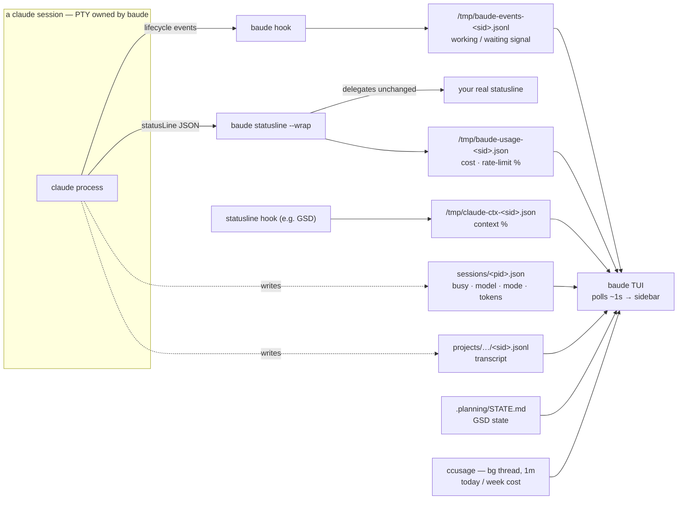

# baude

A TUI for running multiple Claude Code sessions in one terminal.

Start it from any git repo and it spawns a `claude` session there. Add more
repos, or spin up isolated git-worktree sessions for parallel work in the same
repo. A shell pane at the session's folder is one keystroke away. The sidebar
sorts sessions alphabetically by name — when one is **waiting for your input**
it flashes in place (with a wait timer) instead of jumping around, so the list
stays where your eye expects it while still telling you who needs you next.

Each session also surfaces live Claude Code metadata — model, context usage,
permission mode, token counts, and GSD project state — read from the artifacts
Claude writes to disk.

```
╭ baude ──────────────────╮╭ api · waiting · bypass ───────────────╮
│▸ ● api              4m  ││ > claude is waiting for your answer...│
│  fable-5 63% bypass     ││                                       │
│  ● webapp           1m  │╰───────────────────────────────────────╯
│  fable-5 12% ask ph4.5  │╭ shell @ ~/code/api ───────────────────╮
│  ◐ infra                ││ ❯ git diff                            │
│  fable-5 81% bypass     ││                                       │
╰─────────────────────────╯╰───────────────────────────────────────╯
```

## Install

Via [mise](https://mise.jdx.dev) (pulls the prebuilt binary from GitHub releases):

```sh
mise use -g ubi:poindexter12/baude
```

Or from source:

```sh
cargo install --path baude
```

## Usage

```sh
cd ~/code/some-repo
baude            # or: baude /path/to/repo
```

Sessions, worktrees, and shell-pane state persist across restarts
(`~/.config/baude/state.json`). On relaunch each session resumes its most
recent conversation via `claude --continue`.

## How it works

baude never asks Claude Code for anything — it **reads what Claude writes to
disk**. Every session is a real `claude` process in a PTY that baude owns.
baude auto-seeds four lifecycle hooks into each session's `.claude/settings.local.json`;
the `statusLine` bridge is configured once (in your Claude settings, or seeded
by the container). baude then polls the resulting artifacts about once a second
to render the sidebar.



The [Session metadata](#session-metadata) and [Usage panel](#usage-panel)
sections below detail each source. When Claude's own session file or hook
events are present they drive the precise working/waiting signal; absent those,
baude falls back to a PTY output-silence heuristic.

## Keys

A few global chords work the same everywhere; everything else passes straight
through to Claude.

| Key | Where | Action |
|-----|-------|--------|
| `ctrl+q` | anywhere | step out to the sidebar |
| `ctrl+\` | anywhere | toggle shell pane (opening focuses it) |
| `ctrl+e` | anywhere | open the session folder in your editor |
| `ctrl+n` | anywhere | new session (steps out to the sidebar) |
| `ctrl+x` | anywhere | close session (steps out to the sidebar) |
| `alt+←/→` | anywhere | cycle to the prev/next session (wraps) |
| `enter` | sidebar | attach to selected session |
| `j/k` `↑/↓` | sidebar | select session |
| `t` | sidebar | open shell pane (focuses it) |
| `e` | sidebar | open the session folder in your editor (`editor_cmd`, default `code`) |
| `i` | sidebar | session info — model, tokens, context, permission mode |
| `g` | sidebar | GSD project state (`.planning/STATE.md`) |
| `n` | sidebar | new session (enter a repo path; `tab` completes, `ctrl+u` clears; not-yet-cloned repos fall through to `c`) |
| `c` | sidebar | clone a repo (GitHub URL or `owner/repo`) and start a session in it |
| `w` | sidebar | new worktree session for selected repo |
| `r` | sidebar | restart an exited claude |
| `a` | sidebar | archive/unarchive — parked at the bottom, quiet until re-engaged |
| `x` | sidebar | close session (worktree sessions ask keep/remove) |
| `?` | sidebar | help |
| `q` | sidebar | quit |

`alt+←/→` needs your terminal to send Option/Alt as a modifier — on macOS
Terminal and iTerm2 enable this with "Use Option as Meta key". While attached,
this chord shadows Claude's own alt+←/→ word navigation. Likewise `ctrl+e`,
`ctrl+n`, and `ctrl+x` are intercepted everywhere, so they never reach the
shell pane's readline (end-of-line, next-history, `ctrl+x` prefix) or Claude.

## Status icons

- `●` waiting for your input — flashes in place, with a wait timer
- `◐` working — animated spinner
- `✗` exited (`r` to restart)

Waiting is detected from PTY output silence: Claude streams spinner output
continuously while working, so ~2s of quiet means it's your turn. When Claude's
own session file or hook events are present they take precedence over this
heuristic (`exited > hook event > session file > output silence`).

```mermaid
stateDiagram-v2
    [*] --> working
    working --> waiting: Stop hook / ~2s output silence
    waiting --> working: you reply, or a new turn starts
    working --> exited: claude exits
    exited --> working: r — restart (claude --continue)
    waiting --> archived: idle timeout (auto, default 30m), or a (manual)
    archived --> waiting: input re-engages auto-archive; a unarchives a manual one
```



Sessions waiting unattended past the idle timeout auto-archive (default 30
minutes; `auto_archive_minutes` in config or `BAUDED_AUTO_ARCHIVE_MIN`, 0
disables): they sink to a dimmed `▼ archived` section at the bottom and stop
flashing and counting. `alt+←/→` cycling and `j/k` both still reach them —
sending an archived session any input lifts an auto-archive, so cycling in
and typing resurfaces it. A manual archive (`a`) sticks until you unarchive
or re-engage. The daemon applies the same rules, and archived sessions never
send push notifications.

## Cloning

`c` starts a session in a repo you haven't cloned yet. Paste anything that
names a GitHub repo — an ssh or https clone URL, a browser URL (trailing
`/tree/...` is fine), or just `owner/repo` — then confirm the destination,
which defaults to `<clone_base_dir>/<host>/<owner>/<repo>` (tab completes).
The clone runs in the background so the TUI stays responsive, and the
session opens when it finishes. Shorthand and ssh inputs clone over ssh
(`git@host:owner/repo.git`); pasted `https://` URLs keep https. If the
destination already holds a clone, baude just opens a session there.

The `n` prompt falls through to the same flow: if what you enter isn't a
directory on disk but names a repo — a URL, `owner/repo`, or a path whose
tail looks like `<host>/<owner>/<repo>` (e.g. a not-yet-cloned
`~/Code/github.com/owner/repo`) — baude offers to clone it, prefilling the
destination with the path you typed. No need to back out and re-enter via
`c`.

## Worktrees

`w` creates a worktree under `~/.local/share/baude/worktrees/<repo>/<branch>`
(new branch, or checks out an existing one) and starts a claude session in it.
Closing a worktree session asks whether to keep or remove the worktree;
worktrees with uncommitted changes are never removed.

## Usage panel

The bottom of the sidebar shows what you're consuming, and the status bar
shows when the limits refill:

```
│ ──────────────────────│
│ sess            $1.23 │   selected session cost (live)
│ today          $63.58 │   all Claude usage today      (ccusage)
│ week          $104.05 │   all Claude usage this week  (ccusage)
│ 5h ▓▓▓▓▓░░░░░ 47%     │   5-hour block — real account rate limit
│ wk ▓▓▓░░░░░░░ 32%     │   weekly window — real account rate limit
╰───────────────────────╯
 hints │ ~/code/api ⎇ main      ● 2 waiting · 5h resets in 46m · wk in 10d
```

- **today/week cost** — from [`ccusage`](https://ccusage.com), polled on a
  background thread every minute. Shows `—` if ccusage isn't installed.
- **session cost + rate-limit %** — Claude Code only exposes these in the
  JSON it pipes to statusLine commands, so baude ships a bridge:
  `baude statusline` captures the payload to `/tmp/baude-usage-<sid>.json`
  and delegates to your real statusline unchanged. Wire it in
  `$CLAUDE_CONFIG_DIR/settings.json`:

  ```json
  "statusLine": {
    "type": "command",
    "command": "baude statusline --wrap '<your existing statusline command>'"
  }
  ```

  No `--wrap` works too (bridge only, no rendered line). Rate-limit data is
  only sent for Pro/Max subscribers, and only after a session's first
  response — rows show `—` until then.

## Session metadata

The second sidebar line and the `i`/`g` overlays are populated from what
Claude Code writes to disk, refreshed every second:

- **busy/idle + model + permission mode + tokens** — Claude's own session
  file (`$CLAUDE_CONFIG_DIR/sessions/<pid>.json`) and the session transcript
  (`$CLAUDE_CONFIG_DIR/projects/<encoded-cwd>/<sessionId>.jsonl`). When the
  session file is present it replaces the output-silence heuristic for
  waiting detection.
- **context used %** — `/tmp/claude-ctx-<sessionId>.json`, a bridge file
  written by statusline hooks (e.g. the GSD statusline). Absent if no hook
  writes it.
- **GSD state** — `.planning/STATE.md` frontmatter in the session's repo.

`CLAUDE_CONFIG_DIR` is resolved from baude's environment (default
`~/.claude`), the same value the spawned claude processes inherit — so
profile setups with multiple config dirs just work if you launch baude from
the profile's shell.

## Configuration

`~/.config/baude/config.json`:

```json
{
  "claude_cmd": "claude --dangerously-skip-permissions",
  "new_session_dir": "~/Code/github.com",
  "editor_cmd": "code"
}
```

- `claude_cmd` — command to run per session, default `claude`.
  `BAUDE_CLAUDE_CMD` env var overrides the config file.
- `new_session_dir` — prefill for the `n` new-session prompt (tab-complete
  from there); defaults to the directory baude was launched from.
- `clone_base_dir` — base for the `c` clone prompt's default destination,
  laid out ghq-style as `<base>/<host>/<owner>/<repo>`; default `~/Code`.
- `editor_cmd` — command the sidebar `e` key runs on a session's folder
  (the folder path is appended), default `code`. `BAUDE_EDITOR_CMD` env var
  overrides the config file.
- `auto_archive_minutes` — idle minutes before a waiting session
  auto-archives; `0` disables auto-archiving, default `30`.
  `BAUDED_AUTO_ARCHIVE_MIN` env var overrides the config file (both the TUI
  and the daemon honor it).
- `daemon_url` — base URL of a remote bauded daemon (e.g.
  `http://bauded:8642`); its sessions appear in the sidebar under a
  `⇄ remote` section. `BAUDE_DAEMON_URL` env var overrides the config file.
- `backend` — which AI CLI to manage: `claude` (default) or `opencode`.
  `BAUDE_BACKEND` env var overrides the config file. See "opencode backend"
  below.
- `workspace` / `workspaces` — named, hard-separated session pools, each
  bound to one backend. See "Workspaces" below.

## Workspaces

A workspace is a named session pool with its own persisted state
(`state-<name>.json` / `daemon-state-<name>.json`) and a pinned backend, so
claude and opencode sessions can never mix — not on restore, not through a
shared daemon. Two implicit workspaces exist with zero config: `claude` and
`opencode`, each bound to the backend of the same name — so
`BAUDE_BACKEND=opencode baude` and plain `baude` already keep fully separate
histories. Custom workspaces are declared in config:

```json
{
  "workspace": "oss",
  "workspaces": {
    "oss":  { "backend": "opencode", "daemon_port": 8650 },
    "work": { "backend": "claude", "daemon_url": "http://bauded:8642" }
  }
}
```

`BAUDE_WORKSPACE` selects the workspace (then config `workspace`, then the
backend name). A workspace's backend binding **wins over `BAUDE_BACKEND`** —
the env var can't cross-wire a workspace onto the wrong backend (a conflict
warns and is ignored). The status bar shows the active workspace (`⬢ name`).

Daemons serve exactly one workspace: `bauded` reads `BAUDE_WORKSPACE` at
startup, namespaces its state, and reports its identity at `GET /info`; the
TUI refuses to create sessions through a daemon serving a different
workspace. `auto_daemon` runs one daemon per workspace on its own port
(claude `8642`, opencode `8643`, custom via `daemon_port`). The `claude`
workspace reads the legacy un-suffixed state files on first run, so existing
session lists survive the upgrade.

## opencode backend

Setting `backend` to `opencode` (or `BAUDE_BACKEND=opencode`) runs
[opencode](https://opencode.ai) sessions instead of Claude Code. Each session
pins its opencode server to a local port, and baude reads status, model,
title, tokens, and cost over that server's HTTP API — no hooks or statusline
wiring needed. `claude_cmd`/`BAUDE_CLAUDE_CMD` still name the command
(default `opencode`).

Permission modes map as follows: the default `skip` spawns with `--auto`
(auto-approve anything not explicitly denied — the
`--dangerously-skip-permissions` analog), and `BAUDE_PERMISSION_MODE=prompt`
injects ask-rules for `bash`/`edit`/`webfetch` via `OPENCODE_CONFIG_CONTENT`.
In prompt mode under the daemon, pending permissions surface on the PWA's
approve/deny card exactly like Claude's (a per-session bridge subscribes to
opencode's event stream and relays your decision); in the bare TUI, opencode's
own in-terminal prompt keeps working.

Known gaps vs the Claude backend: no context-% gauge, no account rate-limit
windows, and the PWA chat/activity views stay empty (they read Claude's
transcript and hook streams).

## Remote sessions in the TUI

With `daemon_url` set, the daemon's sessions list in the sidebar below your
local ones — same status dots, waiting timers, and metadata. `enter`
attaches: the pane becomes a live raw terminal on the remote session (full
keystroke passthrough over a websocket, resizes follow your pane), so a
session running on your server is indistinguishable from a local one while
attached. `x` kills and `r` restarts remote sessions through the API; shell
panes, worktrees, and the editor key stay local-only.

## bauded (experimental)

A headless daemon (`cargo run -p bauded`) that owns sessions the same way the
TUI does but exposes them over REST + SSE, so thin clients can triage and
chat remotely. Sessions keep running when clients disconnect; daemon restarts
restore them via `claude --continue`. Binds `127.0.0.1:8642` by default
(`--bind` / `BAUDED_BIND`); security model is "bind the VPN interface" — no
auth layer. See `docs/remote-daemon-plan.md`.

The daemon serves a phone-first PWA at `/`: a triage list of sessions (who's
waiting and for how long, model, context %, cost, branch), a chat view with
live updates over SSE, message posting, queued-message bubbles, a terminal
peek drawer for the rare interactive menu, interrupt, and session
create/kill. Open it from any tailnet device and add it to your home screen —
it's installable (manifest + service worker), with no build step and no
external assets.

<p>
  
  
</p>

| Endpoint | What |
|----------|------|
| `GET /sessions` | session list: status, waiting-for, model, context %, branch, cost |
| `POST /sessions` | `{repo, worktree?, name?}` — spawn (worktree = branch name) |
| `DELETE /sessions/{id}` | kill and remove |
| `GET /sessions/{id}/messages?after=<uuid>` | transcript as chat messages |
| `POST /sessions/{id}/messages` | `{text}` — send a message (queues if busy) |
| `POST /sessions/{id}/interrupt` | Esc — stop current work |
| `POST /sessions/{id}/restart` | respawn claude in an exited session (`--continue`) |
| `POST /sessions/{id}/archive` · `/unarchive` | park/unpark (auto after idle timeout; input re-engages) |
| `GET /sessions/{id}/queue` | messages typed while busy, not yet picked up |
| `GET /sessions/{id}/screen` | plain-text terminal snapshot (menu escape hatch) |
| `POST /sessions/{id}/keys` | `{keys}` — named keys or literal text into the PTY |
| `GET /sessions/{id}/pty` | websocket: raw terminal attach (snapshot, then live bytes) |
| `GET /sessions/{id}/stream` | SSE live tail of new messages |
| `GET /push/key` · `POST/DELETE /push/subscribe` | Web Push: VAPID key + subscriptions |

### Deploy (compose + Tailscale)

The provided `compose.yaml` runs bauded behind a Tailscale sidecar — the
daemon is only reachable over your tailnet, nothing is published to the host:

```sh
cp .env.example .env          # set TS_AUTHKEY
docker compose up -d          # pulls ghcr.io/poindexter12/bauded
docker compose exec -it bauded claude   # log in once; persists in a volume
open http://bauded:8642/                # the PWA, from any tailnet device
```

**Full guide — auth-key choices, key-expiry trap, HTTPS for installing the
PWA, updates: [docs/deploy.md](docs/deploy.md).**

The container seeds `statusLine: baude statusline` into the claude config
volume on first run (never overwriting an existing settings.json), so session
cost, context %, and account rate limits flow into the API out of the box.

Sessions run as `claude --dangerously-skip-permissions` (set per-deploy via
`BAUDE_CLAUDE_CMD`) so permission prompts never block unattended work. For
unattended git pushes, uncomment the ssh volume in `compose.yaml` and put an
automation key + config in `./ssh/`.
