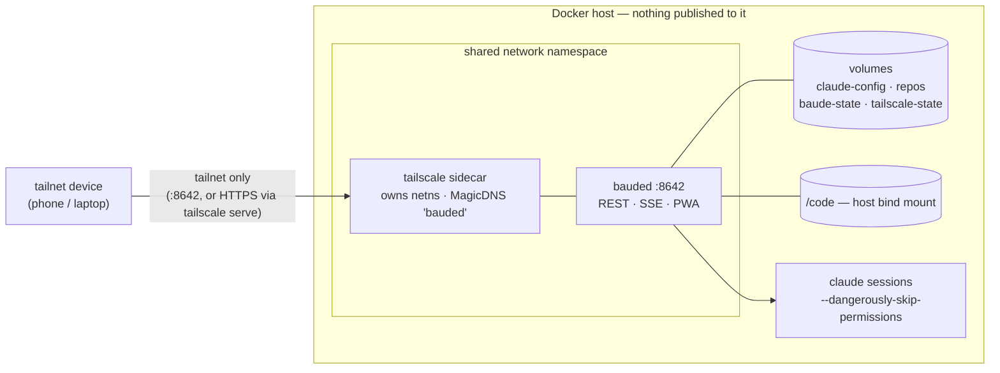

# Deploying bauded

bauded runs as a two-container compose stack: a Tailscale sidecar owns the
network namespace, and bauded shares it. Nothing is published to the host —
**the tailnet is the security boundary**, there is no auth layer in the
daemon itself.



## 1. Create a Tailscale auth key

https://login.tailscale.com/admin/settings/keys → **Generate auth key**:

| Option | Pick | Why |
|--------|------|-----|
| Reusable | **yes** | the key is only consumed at first join, but reusable means a from-scratch recreate (wiped volume, new server) works with the same `.env` |
| Expiration | anything | only limits how long the *key* can be used to join; the joined node is unaffected when it lapses |
| Ephemeral | **no** | ephemeral devices are auto-removed when they go offline (CI-runner feature); you want `bauded` to keep its identity and DNS name |
| Pre-approved | yes | skips manual device approval if your tailnet requires it |
| Tags | `tag:bauded` if you use ACLs | **tagged devices have no node key expiry** — set it and forget it |

“Use as exit node” and the OS install scripts in the admin UI are irrelevant
here — bauded routes nothing, and the official `tailscale/tailscale`
container is already in the compose file.

**Key-expiry trap:** if you join *untagged*, the node's own key expires
after ~180 days and it silently drops off the tailnet. Either use a tag (no
expiry), or after the first `up`: admin console → Machines → `bauded` → ⋯ →
**Disable key expiry**.

To use a tag, your ACL policy must declare an owner first:

```jsonc
"tagOwners": { "tag:bauded": ["autogroup:admin"] }
```

## 2. First run

```sh
cp .env.example .env        # paste the tskey-auth-… key
docker compose up -d        # pulls the published multi-arch image; to hack
                            # on bauded itself, switch to the build: line
docker compose ps           # bauded healthcheck goes healthy in ~10s
```

The device appears on the tailnet as `bauded`. From any tailnet device:
`http://bauded:8642/` is the PWA, `http://bauded:8642/sessions` the API
(MagicDNS assumed; otherwise use the tailnet IP).

## 3. Log claude in (once)

```sh
docker compose exec -it bauded claude
```

Complete the OAuth flow it prints, then exit. Credentials live in the
`claude-config` volume and survive recreates. The container seeds
`statusLine: baude statusline` into that volume on first run (never
overwriting an existing settings.json), so session cost, context %, and
account rate limits flow into the API with no extra setup.

## 4. Put repos on the box

Your host code directory is bind-mounted at `/code` — set it in `.env`
(`CODE_DIR=~/Code` is the default). New sessions from the PWA point at
`/code/<repo>`, with full read/write access.

Alternatively, keep server-local clones in the `repos` named volume:

```sh
docker compose exec bauded git clone <url> /repos/<name>
```

For unattended pushes, uncomment the ssh mount in `compose.yaml` and put an
automation key + config under `./ssh/`. Set git identity once:
`docker compose exec bauded git config --global user.name … && … user.email …`.

## 5. HTTPS — make the PWA installable

Service workers require a secure context, so over plain
`http://bauded:8642` the app works but won't fully install to a home
screen. Tailscale fixes this with real certificates:

1. Admin console → DNS: enable **MagicDNS** and **HTTPS certificates**.
2. One-time:

   ```sh
   docker compose exec tailscale tailscale serve --bg 8642
   ```

The serve config persists in the `tailscale-state` volume. The PWA is then
at `https://bauded.<tailnet>.ts.net/` — open it on the phone, share →
**Add to Home Screen**, and you get the standalone app with the icon.

With HTTPS in place, tap the 🔕 bell in the installed app to turn on push
notifications: the daemon pings your phone when a session has been waiting
on you for 10+ seconds, or when one exits. (iOS requires the home-screen
install for Web Push; Safari-tab visits can't subscribe.)

## 6. Updating

```sh
docker compose pull && docker compose up -d    # grabs the latest release
# building from source instead (build: flavor):
# git pull && docker compose up -d --build
```

Sessions die with the daemon, but state is saved on shutdown and every
session restores on start via `claude --continue`, so conversations carry
across updates.

## Troubleshooting

- `docker compose logs bauded` — restore errors, bind address.
- `docker compose exec tailscale tailscale status` — tailnet connectivity.
- Healthcheck is `curl http://127.0.0.1:8642/sessions` inside the netns.
- Device vanished from the tailnet after months? Node key expiry — see §1.
- A session shows a stuck interactive menu? Open it in the PWA → ▦ — the
  terminal peek drawer drives menus with arrow/enter/esc keys.
